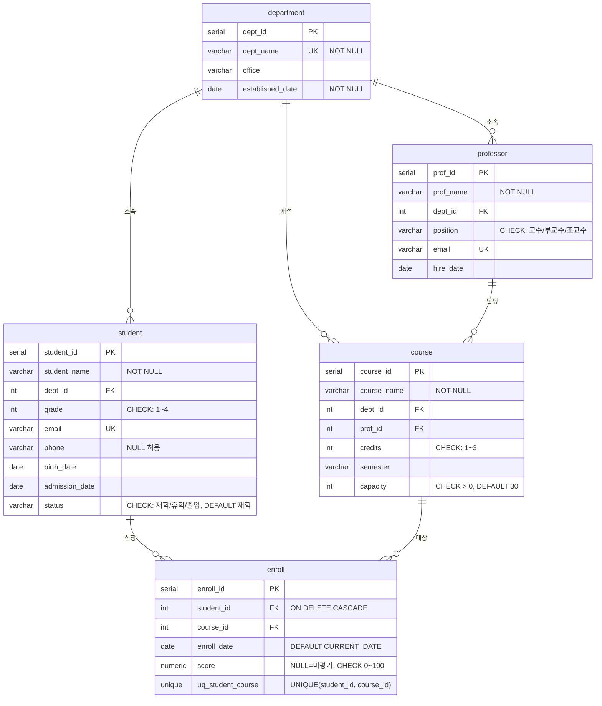

# 8. 종합실습 - 1 : 학사관리시스템 DB 설계 → 구축 → 조회

- **과정**: SKALA 교육과정 Day 6 종합실습
- **작성자**: 광주캠퍼스 4반 박영서
- **DBMS**: PostgreSQL 17 / DB: `skala_edu` / 스키마: `academy`

> `skala_edu` DB는 종합실습 2/3/4에서도 스키마를 추가하며 계속 재사용합니다.

## 1. 설계 개요 (ERD)

학사관리시스템의 핵심 엔터티 5개를 설계했습니다.
학생과 과목은 N:M 관계이므로 `enroll` 교차 테이블로 연결했습니다.



### 적용한 제약조건 요약

| 종류 | 적용 위치 |
|------|-----------|
| PRIMARY KEY | 전 테이블 (`SERIAL` 자동 증가) |
| FOREIGN KEY | professor/student/course → department, course → professor, enroll → student/course |
| UNIQUE | 학과명, 교수/학생 이메일, (student_id, course_id) 중복 수강신청 방지 |
| CHECK | 직급, 학년(1~4), 학적상태, 학점(1~3), 정원(>0), 성적(0~100) |
| NOT NULL / DEFAULT | 주요 컬럼 NOT NULL, status='재학', capacity=30, enroll_date=CURRENT_DATE |
| ON DELETE CASCADE | 학생 삭제 시 수강신청 내역 함께 삭제 |

## 2. 파일 구성

| 파일 | 내용 |
|------|------|
| `광주캠퍼스_4반_박영서_day6종합실습.pdf` | **제출 리포트** — 요구사항 · ERD · 실습 단계 1~8 SQL/결과 화면 |
| `광주캠퍼스_4반_박영서_day6_ERD.png` | **제출 ERD** (범례 포함, 관계선 겹침 없음) |
| `sql/01_create_database.sql` | `skala_edu` DB 생성 (UTF8) |
| `sql/02_ddl_tables.sql` | `academy` 스키마 + 테이블 5개 생성 (DDL, 재실행 가능) |
| `sql/03_dml_insert.sql` | 샘플 데이터 입력 — 테이블당 10건 이상 |
| `sql/04_queries.sql` | 문항별 조회 쿼리 (Q1~Q7) |
| `sql/pgadmin_queries/` | pgAdmin Query Tool용 단계별 분리 쿼리 (한 문항씩 실행·캡처용) |
| `outputs/*.txt` | 각 스크립트 실행 결과 로그 |
| `report/` | 리포트 원본(HTML)·ERD 원본(SVG)·실행 화면 캡처 모음 |

## 3. 실행 방법

```bash
# 1) DB 생성 (최초 1회)
psql postgres -f sql/01_create_database.sql

# 2) 스키마/테이블 생성
psql skala_edu -f sql/02_ddl_tables.sql

# 3) 샘플 데이터 입력
psql skala_edu -f sql/03_dml_insert.sql

# 4) 조회 쿼리 실행 (결과 저장)
psql skala_edu -f sql/04_queries.sql > outputs/04_queries_result.txt 2>&1
```

## 4. 조회 쿼리 문항 구성 (04_queries.sql)

| 문항 | 실습 포인트 | 결과 요약 |
|------|-------------|-----------|
| Q1 | 접속 확인 (`version()`, `current_database` 등) | PostgreSQL 17.10 / skala_edu / academy |
| Q2 | SELECT + WHERE + ORDER BY | 재학 중 2학년 이상 6명, 학년↓·이름↑ 정렬 |
| Q3 | `COALESCE` — NULL 처리 | phone NULL → '연락처 미등록' 표시 |
| Q4 | `CASE WHEN` + `COALESCE` | 성적 → A/B/C/F 등급, NULL → '미평가' |
| Q5 | 날짜 함수 (`AGE`, `EXTRACT`, 날짜 연산) | 나이·입학연도·재학일수 계산 |
| Q6 | 5개 테이블 JOIN (교차 테이블 활용) | 학생-학과-과목-교수-신청일 통합 조회 |
| Q7 | (심화) LEFT JOIN + GROUP BY + HAVING | 수강신청 내역 없는 학생 → 윤지호(졸업) |

## 5. 데이터 입력 건수

| 테이블 | 건수 |
|--------|------|
| department | 10 |
| professor | 10 |
| student | 12 |
| course | 10 |
| enroll | 15 |
